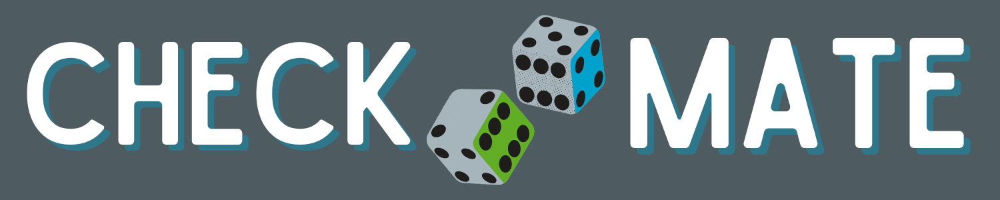

# Check Mate

[](https://opensource.org/licenses/MIT)



Welcome to Check Mate!

Board games provide the opportunity for nearly endless entertainment, able to bring people of all ages together.  And this app is not about that.  Check Mate offers you the opportunity to track your wins and losses, compare your stats to your friend group, find out who has the best winning history for any game in question.  This provides you the opportunity to identify your greatest threats and attempt to partner with the strongest players at any particular game in order to crush and defeat your friends and family.  In the event that humiliating the other players in your gaming group becomes repetitive, users also have the opportunity to submit and review user submitted ruleset variations to add more enjoyability to replaying your favorite games.  


## Table of Contents

1. [Description](#description)

1. [Technologies and Skills](#technologies)

1. [Wireframe](#wireframe)

1. [Screenshot](#screenshot)

1. [Installation](#installation)

1. [Usage](#usage)

1. [License](#license)

1. [Collaborators](#collaborators)

1. [Contact](#contact)

1. [Link to Deployed App](#sample)

## <a id="description"></a>Description

- Check Mate is a full stack application enabling a user to create a profile, and friend groups.  Users can create game events and record the results to participating players individual stats, stored in a Mongo Database.  Users are able to research the stats of their friends and themselves.  Users can submit and review alternate game rule sets for specific games also stored in a Mongo database and follow a link to game specific rules from the game designer if the designer provided such a url.    

## <a id="technologies"></a>Technologies and Skills Demonstrated

Project Methodology
* Github Project Management using SCRUM Methodology

Technologies and Skills
* MongoDb
* Express
* React
* Node
* JWT
* Apollo
* GraphQL
* Board Game Atlas API
* Material UI
* React-Minimal-Pie-Chart
* HTML, CSS

npm Modules
* [React Minimal Pie Chart](https://www.npmjs.com/package/react-minimal-pie-chart)
* [React Share](https://www.npmjs.com/package/react-share)
* [Faker](https://www.npmjs.com/package/faker)

## <a id="wireframe"></a>Wireframe

The wireframe and decision flow chart developed by the team prior to coding to guide the overall process.


[Lucid Flow Chart](https://lucid.app/lucidchart/de7946a0-8639-4d26-8d44-f184f338f276/edit?invitationId=inv_3960a10b-fd03-4360-b988-9731fd16fd70&page=0_0#)

## <a id="screenshot"></a>Screenshot


## <a id="installation"></a>Installation

- The application uses a package manager.  From the root directoy, run the command below to install required modules.

```
npm install
```

## <a id="usage"></a>Usage

- The repo can be forked and then the required modules installed as per above. The application can be run from the command line with the entry point "npm run develop".  A link to the deployed can be found below.

## <a id="license"></a>License

- MIT

## <a id="collaborators"></a>Collaborators

- Amanda Morgan, Ben Slinde, Daniel Quigley, Hannah McDonald, Luke Poirrier 

## <a id="contact"></a>Contact

- If you would like, you can connect with any of the creators through their github profiles

  [Amanda Morgan](https://github.com/AmandaC0022) 

  [Ben Slinde](https://github.com/stevenslade)

  [Daniel Quigley](https://github.com/d4nnyq88)

  [Hannah McDonald](https://github.com/hannahnmcdonald)

  [Luke Poirrier](https://github.com/lukecp5)


## <a id="sample"></a>Link to Heroku Deployment

- [Experience Check Mate for Yourself](https://check-mate-game-app.herokuapp.com/)
